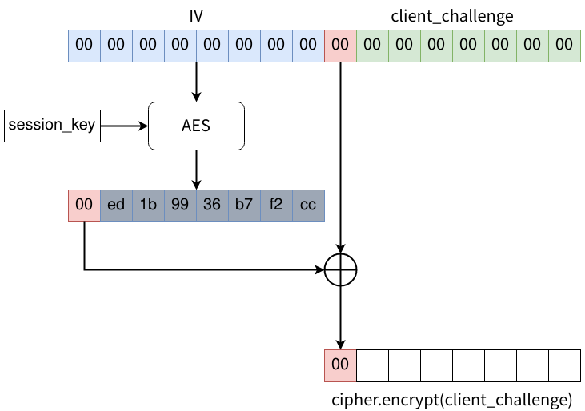
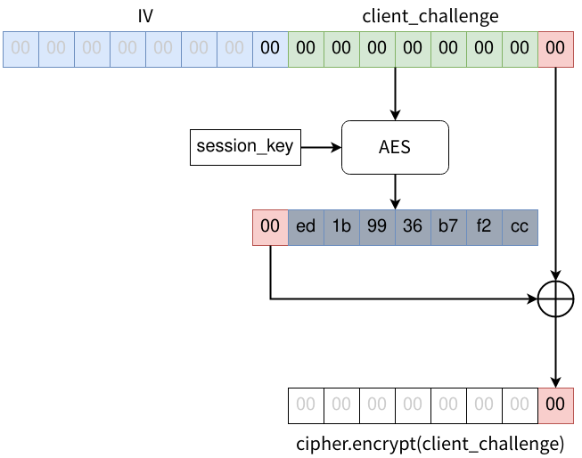

# l0g0n

## 問題文

🕵️‍♂️  
 `nc l0g0n.wanictf.org 50002`

## フラグ

`FLAG{4_b@d_IV_leads_t0_CVSS_10.0__z3r01090n}`

## 解法

CVE-2020-1472、通称Zerologonを簡略化した問題です。  
詳細を知りたい方はWhitepaperを読んでみて下さい。  
Whitepaper: https://www.secura.com/pathtoimg.php?id=2055  

  

Netlogonの認証プロセスで用いられている AES-CFB8 の実装上の問題に起因する脆弱性です。
実装上の問題というのは、本来乱数にする必要があるIV (Initialization Vector) を`b'\x00'*16` で固定していたというものです。これによって認証プロセスを不正に突破することが可能です。本問題においてもIVが固定されており、同様の攻撃でFlagを入手できます。  

challengeを用いて認証を行っています。  

session_key は `psk || client_challenge || server_challenge `  を鍵導出関数に通すことで生成されているので psk さえ分かれば flag が入手できますが、psk は `os.urandom` で毎回生成されているので、session_keyを予測することは実質不可能です。  

しかし、client_challenge を `b'\x00'*8` とした場合、IVが `b'\x00'*16` に固定されていることにより、一定の確率でclient_credentialが `b'\x00'*8` となり、認証を突破することができます。  

以下にAES-CFB8 の暗号化の過程を示します。  

上段：  `IV || plaintext( == client_challenge)`  
下段：  `cipher.encrypt(client_challenge)`   

となっています。  

大まかな流れとしては、

1. `IV || plaintext(client_challenge) ` の先頭8バイト分をAESで暗号化
2. 1. の結果（中段）の先頭1バイトと上段の9バイト目のXORを計算し、暗号文の1バイト目とする

この手順を平文全てを暗号化するまで、1バイトずつずらしながら繰り返します。  

繰り返した結果、最終的には以下のようになります。

1バイトずつずらしても、中段のAESへの入力は変化しないので出力も変化しません。さらにXORの入力も全て同じであるため、結果として `b'\x00'*8` が得られます。このようにして psk  を知らないまま credential を得ることができました。
　ただし、この攻撃は中段のAESの結果の先頭1バイトが `b'\x00'` となった場合にしか成功しません。とはいえ session_key はランダムに変化するため、1/256 の確率で成功します。何度も攻撃していれば通るはずです。

お詫び  

開始後に非想定解法を見つけてしまいました…  正規の方法で通した方、申し訳ありません。
challenge & credential に何も入力しなければ `b''` 同士の比較になって認証が通ってしまいます。
ある意味、実装の脆弱性を突いてはいるのですが、Cryptoらしさは皆無ですね…   テストはしっかりやりましょう。

