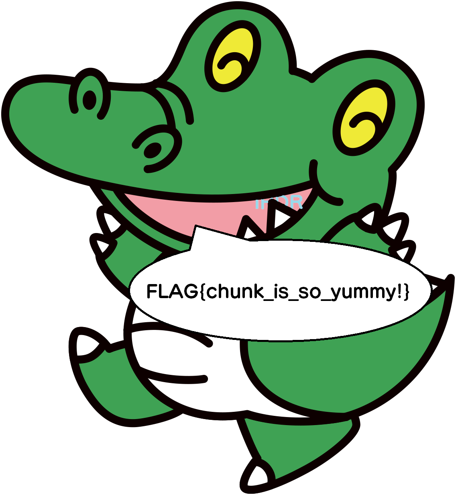

# chunk_eater

## 問題文

pngの必須チャンクをワニ博士が食べてしまいました！

[PNGファイルフォーマット](https://www.setsuki.com/hsp/ext/png.htm)

## フラグ
FLAG{chunk_is_so_yummy!}

## 解法

配布されている`eaten.png`は、ファイルが破損していてそのままでは開けない。

問題文から、必須チャンクというものが影響していると考えられるので、画像を何らかのバイナリエディタで開いて編集する。

バイナリエディタで画像を開くと、「`IHDR`，`IDAT`，`IEND`」が全て「`WANI`」に入れ替わっている。

この3つの中でも、`IDAT`だけは複数設置可能でIHDR と IEND の間にあることに注意。

所定の位置に必須チャンクを入れると、画像が開けるようになる。

