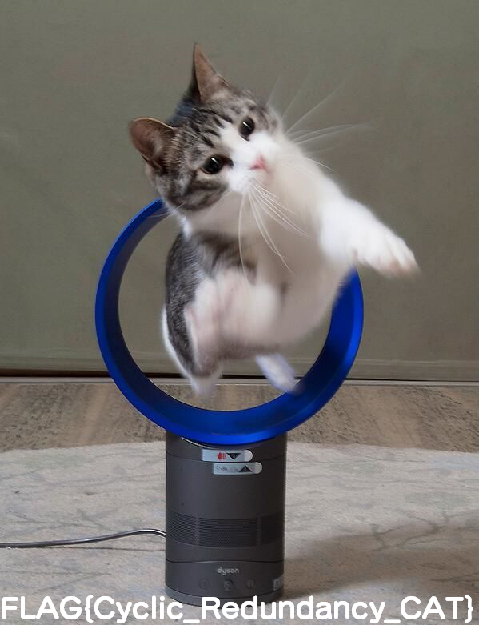

# zero_size_png

## 問題文
この画像のサイズは本当に0×0ですか？

[PNG イメージヘッダ(IHDR)](https://www.setsuki.com/hsp/ext/chunk/IHDR.htm)

## フラグ
FLAG{Cyclic_Redundancy_CAT}

## 解法

配布されている`dyson.png`はそのままでは開けない。
問題文から、画像サイズがおかしいことが想定できるので、バイナリエディタでpngのイメージヘッダを確認する。

画像サイズが"0x0"になっていることが分かる。
pngではCRC32によってデータの破損が検出されるので、正しい縦横比を総当たりで探す。

```
from binascii import crc32

correct_crc = int.from_bytes(b'\xb5\x59\x51\xa1',byteorder='big')

for h in range(2000):
        for w in range(2000):
                crc=b"\x49\x48\x44\x52"+w.to_bytes(4,byteorder='big')+h.to_bytes(4,byteorder='big')+b"\x08\x06\x00\x00\x00"
                if crc32(crc) % (1<<32) == correct_crc:
                        print ('FOUND!')
                        print ('Width: ',end="")
                        print (hex(w))
                        print ('Height :',end="")
                        print (hex(h))
                        exit()
```

上記スクリプトを実行すると以下の出力が得られる。

```
FOUND!
Width: 0x257
Height :0x30d
```

この出力を問題文にリンクを貼ったIHDRのフォーマットに合わせてバイナリエディタから入力すると、無事画像が開けるようになる。

