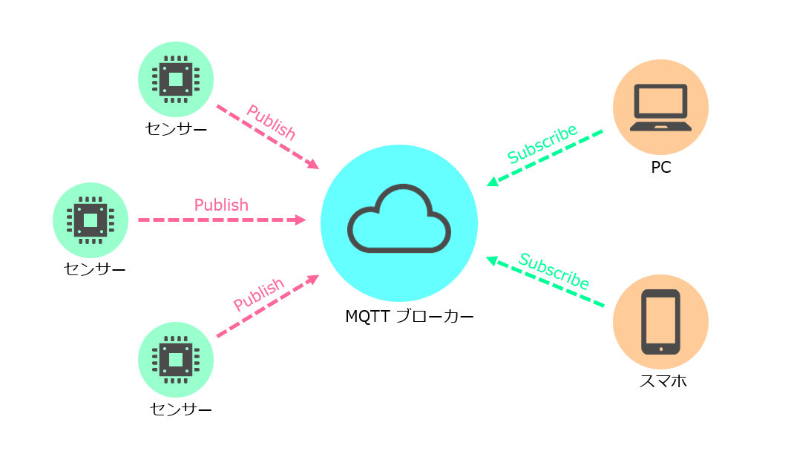
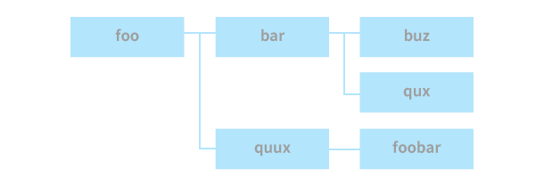
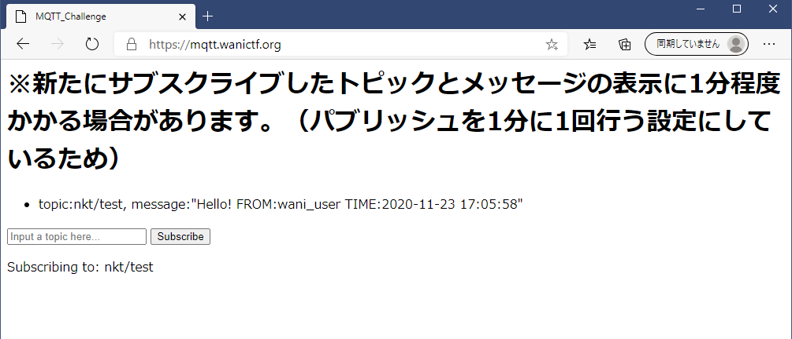
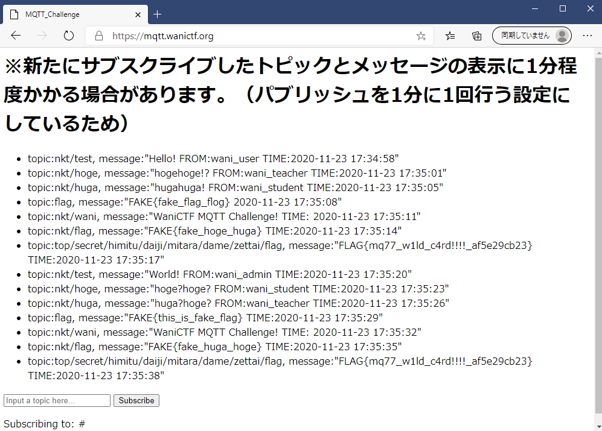

# mqtt_challenge

## 問題文
```
噂の軽量プロトコル「MQTT」をテストするページを作ったよ。どこかに秘密のトピックがあるから探してみてね。

(Hint)

今回の問題ページではあらかじめ「nkt/test」というトピックをサブスクライブしており、他にも「nkt/hoge」「nkt/huga」などのトピックに対してパブリッシュが行われています。

別のトピックを入力して「Subscribe」ボタンを押すとそのトピックをサブスクライブできるので、どうにかしてFLAGを配信しているトピックを見つけてください。

(注意)

データが送信されてくる間隔は約一分程度になっているので、新たにトピックをサブスクライブした際などは少し様子を見てみてください。

まれにコネクションが切れる場合があるので、様子がおかしいときはリロードしてください。

writer: nkt
```

## フラグ
```
FLAG{mq77_w1ld_c4rd!!!!_af5e29cb23}
```

## 解法
MQTTに触れるのは初めてという方も多いかと思うのでなるべく丁寧に説明したいと思います。

### ざっくり背景知識
+ まずMQTTとは
    >MQTTとはMessage Queue Telemetry Transportの略で、publish/subscribeモデルという仕組みに基づいてつくられた軽量なメッセージプロトコルです。
    >
    >ネットワークが不安定な場所や、性能が低いデバイスでも動くように軽量化されているのが特徴で、TCP/IP ネットワークをベースに作られています。
    >
    >出典: https://amg-solution.jp/blog/15787

    

    出典: https://s3-ap-northeast-1.amazonaws.com/amg-s3-01/wp-content/uploads/2018/11/24144017/mqtt_pubsub.png

    MQTTとは上図のようにブローカーを介してConsumerがメッセージをやり取りする仕組みです。

    情報を送る側はブローカーにPublish（発行）して、受け取る側はそれをSubscribe（購読）することで情報を受け取ることができます。

    複数の端末が送信する情報の中から欲しい情報を購読するためにトピックという仕組みがあります。

+ トピックとは

    MQTTのトピックはスラッシュ(/)記号を用いて階層構造を表現します。ディレクトリ構造をイメージすると分かりやすいと思います。

    ```
    foo/bar/baz
    foo/bar/qux
    foo/quux/foobar
    ```

    

    出典: http://devcenter.magellanic-clouds.com/learning/mqtt-spec.html

    MQTTではメッセージにこのようなトピックを付加することで情報を区別できるようにしています。

    メッセージを受け取る側は予め特定のトピックを購読します。するとそのトピックを持ったメッセージが発行されたときに、そのトピックを購読しているユーザーにメッセージを配布してくれる、という仕組みです。

+ ワイルドカード

    トピックの購読は一つ一つ個別に指定することもできますが、特定の記号を用いることで複数のトピックを同時に指定することもできます。その記号をワイルドカードと言います。

    ワイルドカードには+記号と#記号の2種類があります。
    + +記号の例

        ```
        /wani/hoge/nkt
        /wani/huga/nkt
        /wani/hoge/hakase
        /wani/hoge/test/ctf
        ```

        という4つのトピックがあったときに
        
        ```
        /wani/+/nkt
        ```
        
        とすると上2つを購読できます。
        +記号を挿入した一階層分だけ任意のトピックにマッチするものです。
        
    + #記号の例:

        ```
        /wani/hoge/nkt
        /wani/huga/nkt
        /wani/hoge/hakase
        /wani/hoge/test/ctf
        ```

        という4つのトピックがあったときに
        
        ```
        /wani/#
        ```
        
        とするとすべて購読できます。
        #記号を挿入した階層から下の階層すべてにマッチするものです。
    
    MQTTやそのトピックの仕組みについては下記参考ページの方も見ていただけるとより分かりやすいと思います。

    参考: http://devcenter.magellanic-clouds.com/learning/mqtt-spec.html

### 解法
背景知識を元に解法を説明します。

問題ページを見ると



という感じでnkt/testというトピックを購読していることと、一定間隔でメッセージが送られてくることが分かります。

ヒントではFLAGを含むメッセージが発行されているトピックの存在が示されています。
どうにかしてそのトピックを見つけ出したいのですが、直接そのトピックにたどり着くのはエスパーです。

しかし（背景知識でほぼ答えを言っているようなものですが）ワイルドカードを使うと知らないトピックも購読できます。
二つの記号のうち#記号を使うと#記号以下のすべての階層にマッチするのでその仕組みを利用して#というトピックを購読します。

すると、FLAGを含むメッセージやその他すべての階層のメッセージを購読できます。これでFLAGゲットです。



### まとめ
この問題ではMQTTというプロトコル自体あまり知られていない印象だったので、こんなのあるよーという紹介のつもりで問題を作ってみました。

MQTTはIoT機器との通信でよく使われるもので知っていると何かの役に立つはずです。きっと。