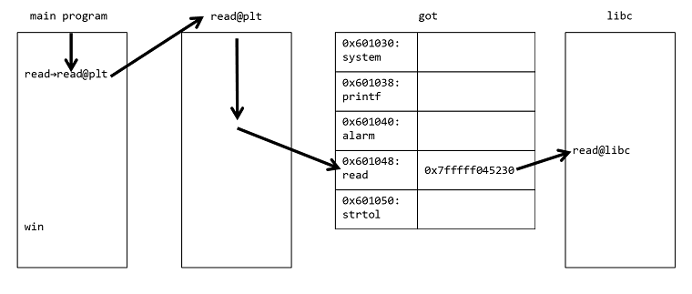
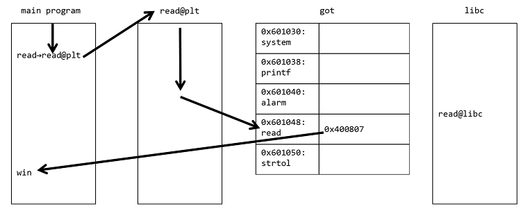

# got rewriter [pwn]
## 問題文

```
nc got.wanictf.org 9004
```
+ global offset table (GOT)の仕組みを理解する必要があります。
+ `objdump -d -M intel ./pwn04 | less`

### 使用ツール例
+ [netcat (nc)](https://github.com/wani-hackase/memo-setup-pwn-utils#netcat)
+ [objdump](https://github.com/wani-hackase/memo-setup-pwn-utils#objdump)

### セキュリティ保護
+ *Partial RELocation ReadOnly (RELRO)*
+ Stack Smash Protection (SSP)有効
+ No eXecute bit(NX)有効
+ Position Independent Executable (PIE)無効

## FLAG
```
FLAG{we-c4n-f1y-with-gl0b41-0ffset-tab1e}
```
## 解法

GOTを書き換えて任意の関数が呼ばれたときに任意のアドレスに飛ばす問題です。
ret rewriteよりもこっちの方で苦戦した人が多かったみたいです。
vuln関数の`*p = val;`でGOTを書き換えます。

GOTとは、動的リンクをする仕組みで、例えばlibc上のread関数をメインプログラムから呼び出したい場合に、コンパイル時ではなく実行時にメインプログラムのread関数とlibc上のread関数を紐づける仕組みです。
read関数を呼ぶ場合、メインプログラムからはread関数のPLT (Procedure Linkage Table)アドレスが呼ばれて、その中でGOTを参照してlibc上のread関数に飛ばされます。
つまりGOTにはread関数のlibc上のアドレスが書き込まれています。
libcのアドレスはセキュリティの都合でASLR (Address Space Layout Randomization)によって実行される度に変わります。



今回はread関数のGOTアドレスをwin関数のアドレスを設定して、メインプログラムでread関数が実行されたときにwin関数に飛ぶようにします。
なので最初の`Please input target address (0x600e10-0x6010b0):`にはreadのGOTアドレスである0x601048を、次の`Please input rewrite value:`にはwinのアドレスである0x400807を入力たら終了です。





### 参考

- [美しき策謀: GOT(グローバルオフセットテーブル)の上書き - Qiita](https://qiita.com/hedgeh0g/items/c18373932671dced4343)
