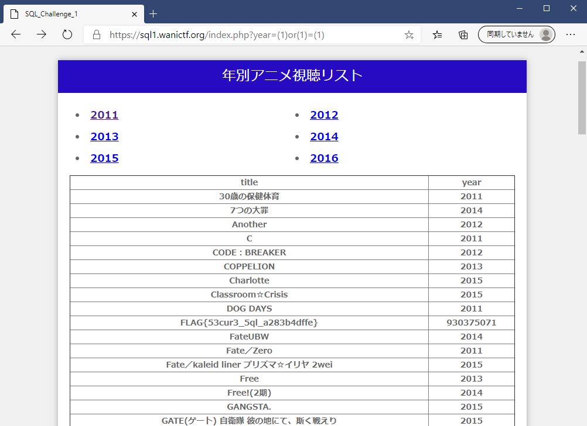

# SQL_challenge_1

## 問題文
```
今まで見たアニメのリストをデータベースに登録したよ。間違えて秘密の情報（FLAG）もデータベースに登録しちゃったけど、たぶん誰にも見られないし大丈夫だよね。

(Hint)

SQL injectionの問題です。

URLの「year=」の後に続く数字(年号)を適切な文字列に変更するとFLAGが表示されます。

一部使えない文字もあるのでソースコード(index.php)を参考に考えてみてください。

必要に応じてデータベースのスキーマ(1_schema.sql)も参考にしてください。

(注意)

sql-chall-1.zipは問題を解くために必須の情報ではなく、docker-composeを利用してローカルで問題環境を再現するためのものです。

興味のある方は利用してみてください。

writer : nkt
```

## フラグ
```
FLAG{53cur3_5ql_a283b4dffe}
```
## 解法
ここでは「SQLとか少しは触ったことあるけど、CTFは初めて」くらいの人を想定してwriteupを書きたいと思います。
### ざっくり背景知識
+ まずSQLとは何か
    >SQLとは、リレーショナルデータベース（RDB：Relational Database）の管理や操作を行うための問い合わせ言語の一つ。業界標準として広く普及しており、様々なデータベース管理システム（DBMS：Databese Management System）で利用できる。
    >
    >DBMSへ利用者や外部のソフトウェアから命令を発行するために用いる言語で、データベースへのテーブルの追加や設定変更、削除、テーブル間の関係の定義や削除、テーブルへのデータの追加、更新、削除、データベースやシステムの設定変更などを行うための命令語と構文、文法などを定めている。
    >
    >出典:http://e-words.jp/w/SQL.html

    + **SQL文**を用いてデータベースに対して様々な操作を行うことが出来る。
    + 本問題では条件を指定してデータベースから情報を抽出する**SELECT文**を利用している。

+ SQL injectionとは
    >データベースと連携したウェブアプリケーションの多くは、利用者からの入力情報を基にSQL文（データベースへの命令文）を組み立てています。ここで、SQL文の組み立て方法に問題がある場合、攻撃によってデータベースの不正利用をまねく可能性があります。このような問題を「SQLインジェクションの脆弱性」と呼び、問題を悪用した攻撃を、「SQLインジェクション攻撃」と呼びます。
    >
    >
    >出典:https://www.ipa.go.jp/security/vuln/websecurity-HTML-1_1.html

    + SQL injectionとはSQL文に不正な文字列を注入(injection)することでデータベースの不正利用を行うこと。
    + データベースを用いたサービスを運用する際はSQL injectionに対しての防御策を取らなければ危険。

### 問題設定
+ 問題ページを開くと以下の画像のようにアニメのリストが表示されます。


+ ヒントにも書いた通りURLのyear=の後に続く数字は年号です。ここに入力した文字列がSQL文に挿入されることになります。  
続いてどのようなSQL文が生成されるか見ていきます。以下は配布ファイルの一つであるindex.phpの一部分です。

    ```
    //urlの"year="の後に入力した文字列を$yearに入れる。
    $year = $_GET["year"];

    //一部の文字は利用出来ません。以下の文字を使わずにFLAGを手に入れてください。
    if (preg_match('/\s/', $year))
        exit('危険を感知'); //スペース禁止
    if (preg_match('/[\']/', $year))
        exit('危険を感知'); //シングルクォート禁止
    if (preg_match('/[\/\\\\]/', $year))
        exit('危険を感知'); //スラッシュとバックスラッシュ禁止
    if (preg_match('/[\|]/', $year))
        exit('危険を感知'); //バーティカルバー禁止                    

    //クエリを作成する。
    $query = "SELECT * FROM anime WHERE years =$year";

    //debug用にhtmlのコメントにクエリを表示させる。
    echo "<!-- debug : ", htmlspecialchars($query), " -->\n";
    ```
+ index.phpを確認すると
    + $yearという変数にURLに入力した値が収められていること
    + いくつか利用出来ない文字があること
    + $yearの値がSQL文に挿入されていること
    + select文を用いてアニメの放映年(years)と一致するものを抽出していること
    + htmlのコメントに作成したSQL文を表示させていること  
    などが見て取れます。  

    もう一つのヒントである1_schema.sqlも確認します。
    ```
    DROP TABLE IF EXISTS anime;

    CREATE TABLE anime (
        name VARCHAR(32) NOT NULL,
        years INT(32) NOT NULL,
        PRIMARY KEY (name)
    );
    ```
+ これはデータベースを構築する際のデータの型などを指定しているファイルです。  
1_schema.sqlを確認すると、
    + テーブルの名前はanimeであること
    + アニメの名前(name)は文字列であること
    + 年号(years)は数値であること

    などが分かります。
    
    テーブル名と年号についてはindex.phpのSQL文とも一致しています。
### 解き方
以上の情報からどのように解いていくのか考えていきます。

問題文からFLAGはデータベースのどこかに存在しているようですが、どのテーブルに存在しているかは分かりません。もしもanime以外のテーブルにFLAGがあるのだとしたら少し手間がかかりそうですが、まずはanimeというテーブルにFLAGが無いかを確認するところから挑戦してみましょう。

PHPで生成しているSQL文の解釈は以下のようになります。


このSQL文ではユーザーが$yearに入れた年号とyearsカラムのデータを比較して条件が真となるものを取り出しています。

本来は$yearに年号が入力されることを想定しているのですが、いい感じの文字列を入れてあげると想定を外れてどのようなデータに対しても条件が真にすることができ、animeテーブルのすべてのデータを見られます。

このように本来の想定を外れてSQLを操作できるような状態のとき「SQLインジェクションの脆弱性がある」と言います。

典型的なSQL injectionを今回の問題にあてはめると以下のような感じでSQL文の条件を真に出来ます。


条件①については年号が一致しなければ真になりませんが条件②についてはどのようなデータに対しても真になります。そして条件①と条件②のORを取っているので全体としては真になります。

このようなSQL文を生成させることが出来ればanimeのデータを見られるのですが、ここでもう一つ問題があります。index.phpではpreg_matchによって空白などが使用禁止になっています。

よって空白などを使わずに同じような仕事をしてくれるSQL文を生成しなければなりません。以下が解答例です。


ということで空白を使えない代わりにそれぞれの値を()で囲ってあげるとanimeのリストがすべて表示され、その中にFLAGを見つけることが出来ます。



この他にも(1)OR(1)、(2011)OR(1=1)、(1)OR(TRUE)などでもFLAGを入手できます。

## まとめ
この問題ではPHPからMySQLを呼び出す方法や、SQLの比較演算について学んで頂けたらという意図で作りました。

勉強になることがあったようであれば嬉しいです。

## 補足
この問題では'years = years'という非想定解がありました。
SQLの二問目にも影響する話なので詳しくは2問目のwriteupの補足をご確認ください。