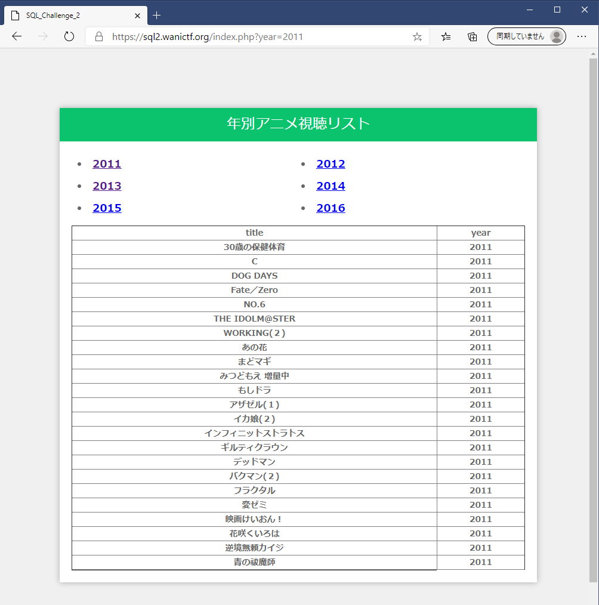
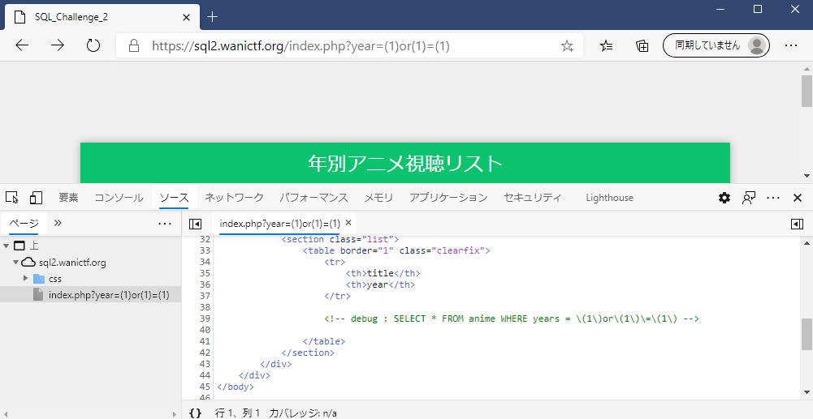
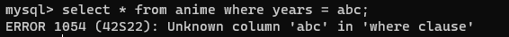
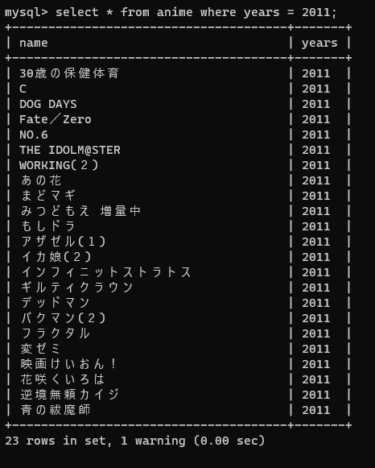
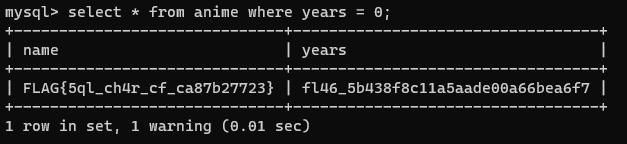

# SQL_Challenge_2

## 問題文
```
やっぱり前のページは危ない気がするからページを作り直したよ。これで大丈夫だね。

(Hint)

SQL injectionの問題です。

必要に応じてソースコード(index.php)とデータベースのスキーマ(1_schema.sql)を参考にしてください。

(注意)

sql-chall-2.zipは問題を解くために必須の情報ではなく、docker-composeを利用してローカルで問題環境を再現するためのものです。

興味のある方は利用してみてください。

writer : okmt, nkt
```

## フラグ
```
FLAG{5ql_ch4r_cf_ca87b27723}
```
## 解法
SQL_Challenge_1に引き続き初めてCTFに参加される人向けになるべく丁寧に書いていこうと思うのでよろしくお願いします。またこの問題の解説はSQL_Challenge_1と比較する形で書こうと思います。予めSQL_Challenge_1のwriteupも読んでもらえると嬉しいです。

以下
```
SQL_Challenge_1 --> SQL1

SQL_Challenge_2 --> SQL2
```
と記述します。
### 問題設定
SQL2の問題ページを開くとSQL1と色違いのページが表示されます。



この問題でもindex.phpと1_schema.sqlが配布されているので、まずはそちらの中身を確認します。

```
//urlの"year="の後に入力した文字列を$yearに入れる。
$year = $_GET["year"];

//preg_replaceで危険な記号を処理する。
$pattern = '/([^a-zA-Z0-9])/';
$replace = '\\\$0';
$year = preg_replace($pattern, $replace, $year);

//クエリを作成する。
$query = "SELECT * FROM anime WHERE years = $year";

```
index.phpを見てみると、SQL1ではいくつかの記号が禁止されていた部分が変更されています。

preg_replaceは簡単に説明すると正規表現にマッチする文字や文字列を別の文字列に置き換える、あるいは別の文字を追加する、といったことが出来ます。この問題のpreg_replaceは「アルファベットと数字以外の文字の前にバックスラッシュ(円マーク)を追加する」という動作をしています。

続いてスキーマも確認します。
```
DROP TABLE IF EXISTS anime;

CREATE TABLE anime (
    name VARCHAR(32) NOT NULL,
    years VARCHAR(32) NOT NULL,
    PRIMARY KEY (name)
);
```
SQL1と比べると、yearsカラムが数値型ではなく文字列型になっています。

### 解き方
以上の情報からSQL2を解いていきます。

試しにSQL1の解答(year=(1)or(1)=(1))を送信してもFLAGはもちろん何のデータも表示されません。

送られたクエリをソースコードで確認すると、



```
SELECT * FROM anime WHERE years = \(1\)or\(1\)\=\(1\)
```
というようにカッコやイコールの前にバックスラッシュが挿入されています。これによって上手く動作しなくなっているようです。

ところでこのSQL文はそもそも文字列の比較をしてくれないものとなっています。

[MySQLの公式マニュアル](https://dev.mysql.com/doc/refman/5.6/ja/string-literals.html)によると文字列とは「単一引用符 (「'」) または二重引用符 (「"」) で囲まれたバイトまたは文字のシーケンス」のことです。

よってSQL2のindex.phpで生成されるSQL文ではyearsカラムは文字列型なのに、'years='以下に入力した文字列を文字列として扱ってくれない、といういびつな状況となっています。

ちなみにMySQLにログインして例えば'years=abc'として直接SQL文を入力してみると、



こんな感じでエラーになってしまいます。引用符無しで文字列を入れてもエラーにしかならないのです。

しかし年号を入れた場合は、



ちゃんと表示されました。なせこのような違いが生まれるのでしょうか？

MySQLでは比較演算を行う際、比較対象の一方が数値ならもう片方も数値として扱うという暗黙的な型変換が行われるようです。「2011」を入力した場合、これを数値として扱っているのでエラーになりません。更にもう片方の比較対象、つまりyearsカラムの文字列も数値に変換されたうえで比較を行うので年号に対しては適切に比較が行われる、ということになります。

しかしyearsカラムに数字以外の文字列が入っていた場合、その文字列はすべて0という値に変換されます。

よって'years = 0'と入力すると年号や数字以外の文字列で記録されているデータが表示できるので、



このようにFLAGを得ることが出来ます。
他にも'years = 0-0', 'years = false'でも0と認識するのでFLAGを得ることができます。

## まとめ
SQL2を出題の意図としてはSQLの暗黙の型変換によって意図しない動作が生まれる可能性があることを知ってもらいたいということでした。

また公式マニュアルには色々重要なことが書いてあるので、困ったらマニュアルを読むことも大切なことかと思います。

## 補足
SQL2では、上記のようにindex.phpのSQL文とスキーマをヒントにして'years = 0'を導き出す、という誘導を行っていました。

しかしこれ以外にも非想定解があります。

それは'years = years'とする方法です。これならpreg_replaceの影響も受けずに条件を真にできるので、FLAGを含めてテーブルのデータをすべて入手できます。

またこの手法はSQL1に対しても有効なので、SQL1を'years = years'で解いた人はSQL2をすぐに解けたと思います。

この非想定解についてはSQL1とSQL2の難易度の差を担保する上でも塞いでおくべきだったのですが、チェック段階で見過ごしてしまっていたため'years = years'で解いた方の問題を解く楽しみを一つ奪ってしまったと反省しています。申し訳ありませんでした。

公開大会で作問するという中で自分自身も学ぶところは大きかったので、次回に向けてこの経験を生かしていきたいと思います。